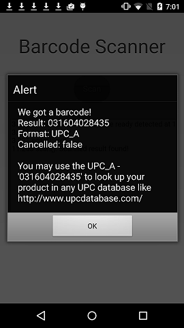

## Barcode Scanner App using Phonegap* Barcode Scanner plugin

_The source code for this sample can be found here: [https://github.com/gomobile/sample-barcode-scanner](https://github.com/gomobile/sample-barcode-scanner "https://github.com/gomobile/sample-barcode-scanner") or download the_ [Intel® XDK](https://software.intel.com/en-us/html5/tools) to check out all of the HTML5 samples and templates.

## Introduction

Intel XDK® is a HTML5 hybrid application development environment that allow users to develop, debug, test on-device and build projects for various mobile platforms. Along with development features, this development environment provides various HTML5 templates and samples intended for running on various mobile devices and platforms. For more information on getting started, go to the [Intel XDK Overview](/en-us/xdk/docs/intel-xdk-overview).

## Purpose

By leveraging the [Apache Cordova* plug-ins](http://plugins.cordova.io/#/), you can develop compelling HTML5 hybrid apps for any platform and use case. [Apache Cordova](http://cordova.apache.org/) is a set of device APIs that allow a mobile app developer to access native device function such as the camera or accelerometer from JavaScript. Besides the standard APIs, various plug-ins are available in the [Apache Cordova Plug-ins Registry](http://plugins.cordova.io/#/) and located across the web on github. .

With this sample app, you scan a barcode using the Phonegap* Barcode Scanner plugin to retrieve Universal Product Code (UPC) that can be used for product lookup in a UPC database. The plugin also supports other barcode types such as QR_CODE, DATA_MATRIX, AZTEC among many others.

The app shows how to use the following plugin methods:

[Phonegap* Barcode Scanner plugin](https://github.com/phonegap/phonegap-plugin-barcodescanner)

- cordova.plugins.barcodeScanner.scan(): Activates device camera to scan barcode and on successful product identification, passes an object with: 
	- data (text representation of the barcode data)
	- type (type of barcode detected) 
	- cancelled (whether or not the user cancelled the scan) 

            cordova.plugins.barcodeScanner.scan(
                function (result) {
                    console.log(fName, "Scanned result found!");
                    alert("We got a barcode!\n" +
                        "Result: " + result.text + "\n" +
                        "Format: " + result.format + "\n" +
                        "Cancelled: " + result.cancelled + "\n\n" +
                        "You may use the " + result.format + " - '" + result.text + "' to look up your product in any UPC database like http://www.upcdatabase.com/");
                },
                function (error) {
                    alert("Scanning failed: " + error);
                }
            );

Each button click is bound with methods that encapsulate the functionality of the plugin or API. These methods are defined in `app.js`.

  

## Testing

**Emulator:** Does not support third party plugins. So this app must be built and tested on device.

**App Preview:** Does not support third party plugins. So this app must be built and tested on device.

**Built app:** This sample application has been tested on iOS and Android devices.

